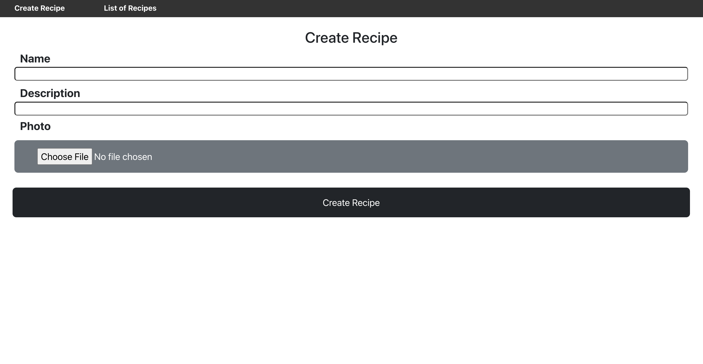
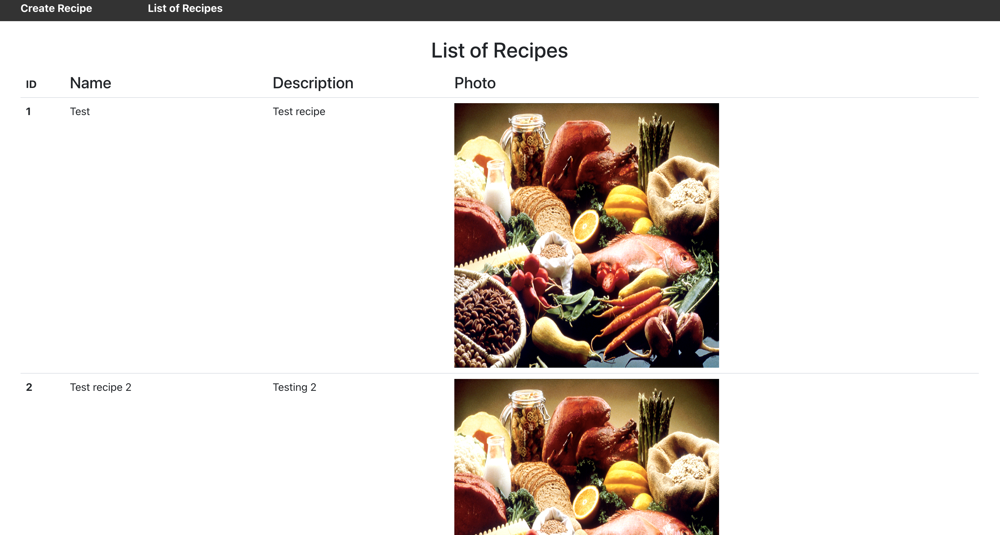

# Recipe React App
- This is a frontend application built using ReactJS and Bootstrap that allows a user to create and view a list of exiting recipes from the backend API. The related backend repo is [here](https://github.com/jyou044/recipe-app-backend).

## Steps for use
1. Clone the repo
2. Run `npm install` to install all dependencies
3. Run `npm start` to start the application

## App examples
- Create a recipe

- View all recipes

## Next steps
- Add a delete option for recipes on the UI
- Let the user know when a recipe has been successfully added
- Update the UI to be more user friendly and enhance UX